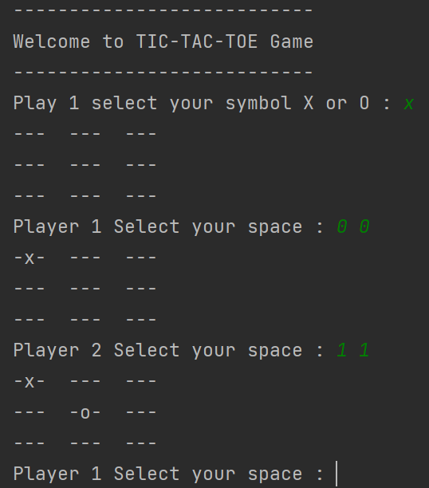
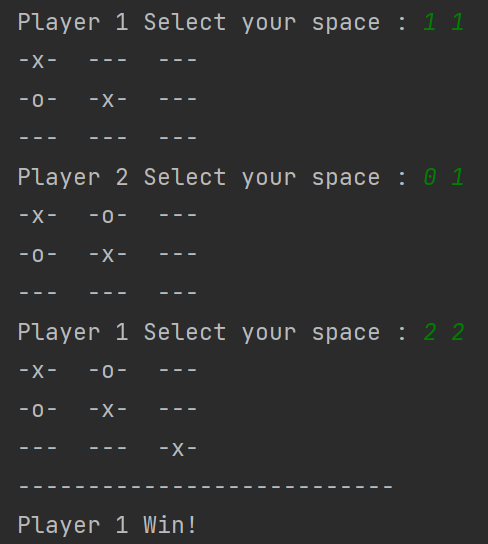
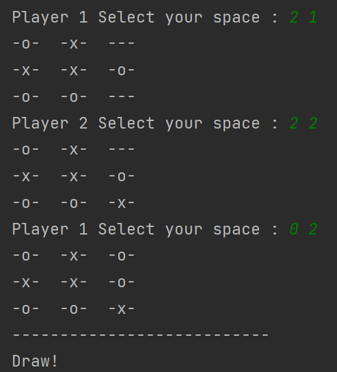

# SIMPLE TIC TAC TOE GAME(version 0.0.1)
This game created with java language, the game has simple codes and is not beatuful.

## About Game
- Player can select symble  X or O and select your space with 2D Arrays.

- When the player who succeeds in placing three of their symble in a horizontal, vertical, or diagonal is the winner. 

- When both players fail in placed three of their symble is called draw.

